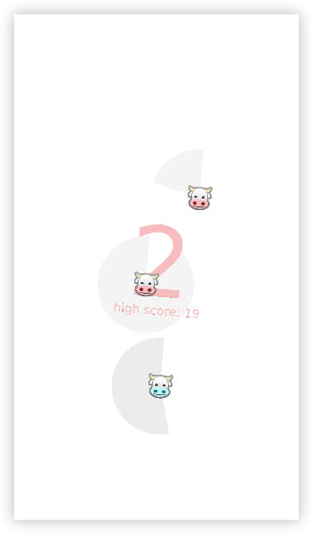

## Cow Game

A mobile game. Straightforward but also pretty darn polished and fun.

Here's a screenshot (complete with artifacts from being scaled down and mid-animation):

### Installation

1.  lol are you being serious?
2.  Download XCode from the Mac App Store.
3.  Create a developer account [here.](http://developer.apple.com/) Click on "Account" in the top right and log in with your Apple ID.
4.  Open XCode. Go to Xcode > Preferences > Accounts, press the +, and then add the account you used in the previous step.
5.  [Download the game.](https://people.ucsc.edu/~spjpeter/arch/cow-game/CowtetGameSource.zip)
6.  Open the zip file and navigate to `love-0.10.0-ios-source/platform/xcode/` and open `love.xcodeproj`.
7.  Make sure you phone is connected to the computer. Select your device from the drop-down menu in the top left.
8.  Once XCode finishes "processing symbols" or whatever it does, press the play arrow in the top left.
9.  The game should now install, but will be unable to run. To authorize it, muck around in the settings app on your phone until you find something that looks right.

### Uninstallation

*   No

### Updating

Occasionally I may release updates. The game doesn't actively check for updates, but if you'd like to force an update:

1.  Double click the home button and swipe up to terminate the Cowtet Game.
2.  Open the Cowtet Game!

Assuming the update host is online, your game is now up-to-date.
